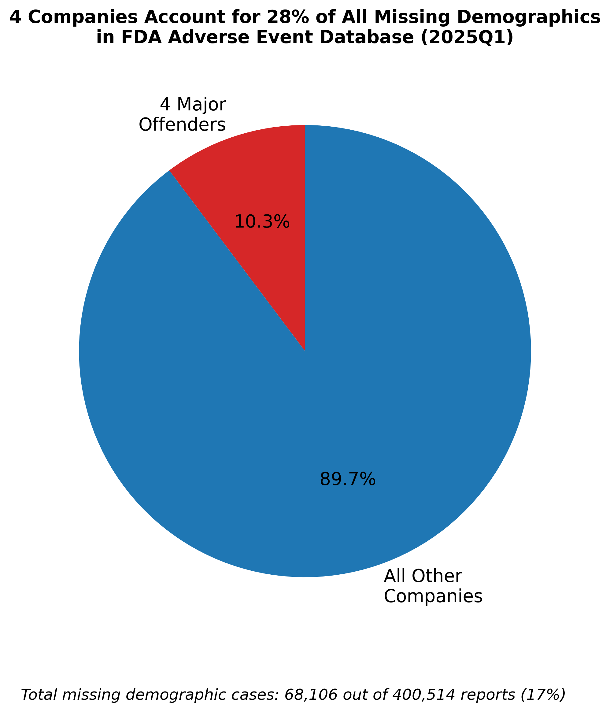

# FAERS 2025Q1: Systemic Demographic Data Failures in FDA Adverse Event Reporting
## Access the Full Analysis

## Summary

This repository contains an independent analysis of the FDA's FAERS database (Q1 2025), revealing serious data quality issues in adverse drug event reporting. 

Key findings:
- **17%** of all reports in Q1 2025 are missing critical demographic fields (age, sex, weight)
- **4 pharmaceutical companies** — Celltrion, Sunovion, Lupin, Alexion — account for **27.8%** of the entire data gap
- Records exist with impossible values, including:
  - Event dates from the year **1025 AD**
  - A **19-day-old infant** allegedly weighing **3,912 kg (8,620 lbs)**
  - Misused report codes (e.g., `5DAY`, `30DAY`)

## Why This Matters

These data are used by FDA, researchers, and healthcare professionals to detect drug safety signals and make life-saving decisions. Systematic reporting failures compromise that mission.

## Files

- `ffaers_2025Q1.ipynb` – full Jupyter notebook with methodology and visualizations
- `/images/` – shareable graphics (see below)
- `/data/README.md` – instructions for downloading raw FDA files

## Visualization Previews

## Reproducibility

All code is reproducible using public FDA data available at:  
https://fis.fda.gov/extensions/FPD-QDE-FAERS/FPD-QDE-FAERS.html

## Author

Micheal Beatty [LinkedIn](https://linkedin.com/in/mwbeatty)  
Chicago-based data analyst, software engineer, and civic tech advocate.

---

**This repo is open source. Please cite or credit if using in reporting or further research.**
